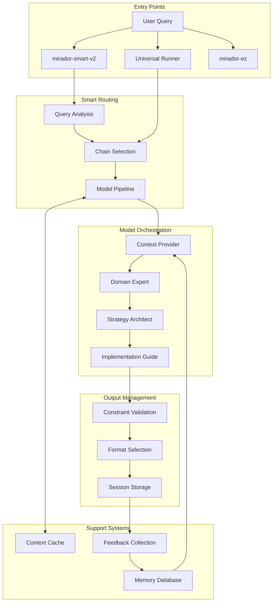

# Mirador AI Framework

[](https://github.com/guitargnar/mirador)
[](https://opensource.org/licenses/MIT)
[](./tests)
[](https://ollama.ai)
[](https://www.apple.com/macos/)

> **Mirador**: *A Spanish term meaning "lookout" or "viewpoint" - a place that offers expansive views and new perspectives*

## 🌟 Overview

Mirador is a sophisticated AI orchestration framework that intelligently chains multiple specialized language models to deliver comprehensive, nuanced responses. By routing queries through carefully crafted sequences of models, each contributing their unique expertise, Mirador transforms simple prompts into rich, actionable insights.

### Core Philosophy

Instead of relying on a single AI model, Mirador embraces the principle of specialized expertise. Like a well-coordinated team where each member brings unique skills, Mirador orchestrates 80+ specialized models to tackle complex queries with depth and precision.

## 🚀 Key Features

- **🧠 80+ Specialized Models**: Each optimized for specific domains (finance, health, creativity, strategy, etc.)
- **⚡ Smart Query Routing**: Automatically selects optimal model chains based on query analysis
- **🔒 100% Local Processing**: All models run locally via Ollama - no external API dependencies
- **🎯 Context Accumulation**: Each model builds upon insights from previous models in the chain
- **📊 Multiple Output Formats**: Quick summaries, detailed analysis, or export-ready documents
- **🔄 Feedback Learning**: Rate outputs to improve future responses
- **💾 Memory System**: SQLite-based conversation history for contextual awareness
- **🌐 Diverse Base LLMs**: Leverages Llama 3.2, Gemma 2, Qwen 2.5, Phi-3, Command-R, and more

## 🏗️ Architecture



### Model Chaining Pattern

Each chain follows a progressive enhancement pattern:

1. **Context Provider**: Establishes personal/professional background
2. **Domain Expert**: Applies specialized knowledge to the query
3. **Strategy Model**: Develops comprehensive approaches
4. **Implementation Model**: Translates strategies into actionable steps

## 🚀 Quick Start

### Prerequisites

- macOS with Apple Silicon (M1/M2/M3) or Intel
- [Ollama](https://ollama.ai) installed
- Python 3.8+
- 16GB+ RAM (32GB recommended for larger models)
- 100GB+ free storage for models

### Installation

```bash
# Clone the repository
git clone https://github.com/guitargnar/mirador.git
cd mirador

# Install Ollama (if not already installed)
brew install ollama

# Start Ollama service
ollama serve &

# Install Python dependencies
pip3 install -r requirements.txt

# Install diverse base LLMs (takes 30-60 minutes)
./install_diverse_models.sh

# Create specialized models
./create_diverse_models.sh

# Create consolidated models (Phase 2)
./scripts/consolidate_models_phase2.sh

# Run initial setup
./setup_mirador.sh

# Test the installation
./tests/run_tests.sh
```

## 📋 Usage Examples

### Basic Usage with Smart Routing

```bash
# Let Mirador analyze and route your query intelligently
./mirador-smart-v2 "Help me create a financial plan for the next quarter"

# Simple interface with custom models
./mirador-ez chain "Analyze my career options" model1 model2 model3
```

### Universal Runner with Chain Types

```bash
# Life optimization chain
./mirador_universal_runner_v2.sh life_optimization "I need better work-life balance" detailed

# Business acceleration chain
./mirador_universal_runner_v3_optimized.sh business_acceleration "Expand my consulting business" summary

# Creative breakthrough chain
./bin/mirador_universal_runner_v3_optimized.sh creative_breakthrough "Design a new product concept" export
```

### Available Chain Types

- **life_optimization**: Personal productivity and life balance
- **business_acceleration**: Business strategy and growth
- **creative_breakthrough**: Creative projects and innovation
- **relationship_harmony**: Communication and relationships
- **technical_mastery**: Technical problem-solving
- **strategic_synthesis**: High-level strategic planning
- **deep_analysis**: In-depth analytical tasks
- **global_insight**: Multicultural and global perspectives
- **rapid_decision**: Quick decision-making support

### Output Formats

- **quick**: Bullet points and key takeaways only
- **summary**: Concise overview (default)
- **detailed**: Comprehensive analysis with context
- **export**: Full output saved to file

### Advanced Features

```bash
# Analyze documents with RAG chains
./test_rag_chain.sh document "path/to/document.pdf" "Summarize key findings"

# Test model performance
python3 tests/test_performance.py

# View usage statistics
python3 context_manager.py stats

# Provide feedback on outputs
./mirador_feedback.sh SESSION_ID 5 "Excellent strategic insights"

# Run comprehensive system health check
./daily_check_enhanced.sh
```

## 🎯 Model Descriptions

### Core Context Providers
- **matthew_context_provider_v6**: Personal and professional context grounding
- **universal_context_provider**: General-purpose context establishment

### Domain Specialists
- **financial_planning_expert**: Investment and financial strategies
- **health_wellness_optimizer**: Health and wellness guidance
- **guitar_expert**: Music theory and guitar techniques
- **louisville_expert**: Local Louisville knowledge and insights
- **ai_leadership_strategist**: AI and technology leadership

### Strategy Models
- **universal_strategy_architect**: High-level strategic planning
- **business_strategist_fast**: Rapid business strategy development
- **creative_catalyst**: Innovation and creative solutions

### Implementation Models
- **practical_implementer**: Actionable step-by-step plans
- **action_crystallizer**: Clear, prioritized action items
- **decision_simplifier**: Complex decision clarification

### Base LLM Diversity
- **Llama 3.2**: Primary model for most contexts (~70%)
- **Gemma 2 27B**: Google's model for analytical reasoning
- **Qwen 2.5 32B**: Alibaba's multilingual model
- **Phi-3 Medium**: Microsoft's ultra-fast model
- **Command-R 35B**: Cohere's RAG-optimized model

## ⚙️ Configuration

### Environment Variables

Create a `.env` file in the project root:

```bash
# Ollama settings
OLLAMA_HOST=http://localhost:11434
OLLAMA_TIMEOUT=300

# Model parameters
DEFAULT_TEMPERATURE=0.7
DEFAULT_MAX_TOKENS=2048
DEFAULT_CONTEXT_WINDOW=8192

# Performance settings
CACHE_ENABLED=true
CACHE_TTL=3600
MAX_CONCURRENT_MODELS=3
```

### Model Configuration

Model behavior can be customized by editing the modelfiles in `/models/`:

```dockerfile
# Example: Adjusting temperature for creative models
PARAMETER temperature 0.9
PARAMETER top_p 0.95
PARAMETER num_predict 2048
```

## 🧪 Testing

Mirador includes a comprehensive test suite:

```bash
# Interactive test menu
./tests/run_tests.sh

# Quick validation (5 min)
./tests/run_tests.sh quick

# Standard test suite (15 min)
./tests/run_tests.sh standard

# Comprehensive tests (30+ min)
./tests/run_tests.sh comprehensive

# Test specific functionality
python3 tests/test_chains.py
python3 tests/test_models.py
python3 tests/test_performance.py

# Real-world scenario testing
./tests/test_real_world_scenarios.sh
```

## 🛠️ Troubleshooting

### Common Issues

**Models not responding:**
```bash
# Check Ollama service
ollama list
ollama serve

# Verify model installation
ollama run matthew_context_provider_v6

# Check system resources
./monitor_mirador_performance.sh
```

**Slow performance:**
```bash
# Optimize model loading
./optimize_model_performance.sh

# Clear cache
rm -rf .cache/

# Reduce concurrent models
export MAX_CONCURRENT_MODELS=2
```

**Memory issues:**
```bash
# Use smaller models
./mirador_universal_runner_v2.sh life_optimization "query" quick

# Monitor memory usage
python3 tests/test_performance.py --memory
```

### Debug Mode

Enable verbose logging:
```bash
export MIRADOR_DEBUG=true
./mirador-smart-v2 "test query"
```

## 🤝 Contributing

We welcome contributions! Please see [CONTRIBUTING.md](CONTRIBUTING.md) for guidelines.

### Development Workflow

1. Fork the repository
2. Create a feature branch (`git checkout -b feature/amazing-feature`)
3. Make your changes
4. Run tests (`./tests/run_tests.sh`)
5. Commit with descriptive message
6. Push to your fork
7. Open a Pull Request

### Adding New Models

1. Create a modelfile in `/models/domain/`
2. Build the model: `ollama create model_name -f modelfile`
3. Add to appropriate chains in runner scripts
4. Test thoroughly with sample queries
5. Document in this README

## 📄 License

This project is licensed under the MIT License - see the [LICENSE](LICENSE) file for details.

## 🙏 Acknowledgments

- Built on [Ollama](https://ollama.ai) for local model execution
- Inspired by Unix philosophy of specialized tools working together
- Community contributors who have helped shape Mirador

## 📚 Additional Resources

- [Architecture Documentation](docs/ARCHITECTURE.md)
- [Model Documentation](docs/MODELS.md)
- [API Reference](docs/api/)
- [Quick Reference Guide](docs/QUICK_REFERENCE.md)
- [Ollama Model Guide](docs/ollama/MODEL_ARCHITECTURE.md)

---

<div align="center">
  <h3>🔮 Mirador: Expanding Perspectives Through Orchestrated Intelligence</h3>
  <p>Transform your queries into comprehensive insights with the power of 80+ specialized AI models working in harmony.</p>
  
  <p>
    <a href="https://github.com/guitargnar/mirador/issues">Report Bug</a> •
    <a href="https://github.com/guitargnar/mirador/discussions">Discussions</a> •
    <a href="docs/guides/">Guides</a>
  </p>
</div>