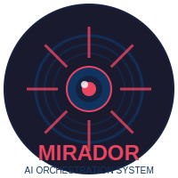
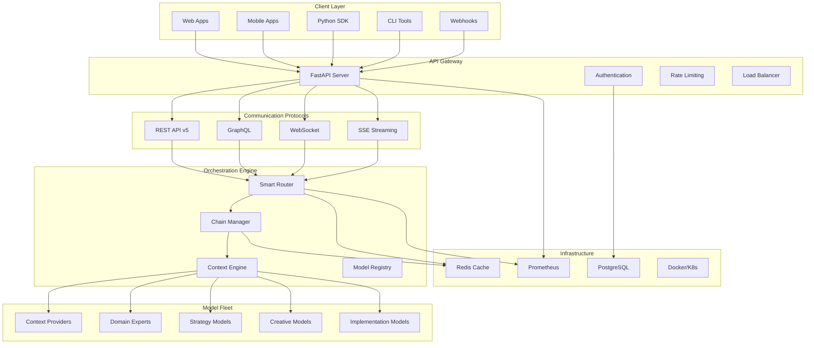
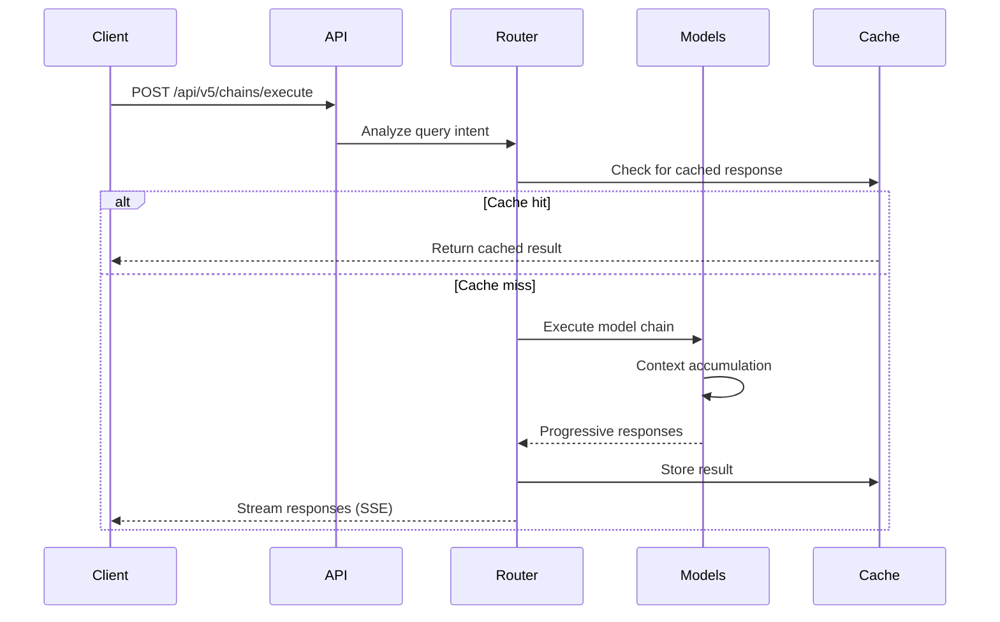

<div align="center">
  
  
  # Mirador AI Orchestration Platform
  
  *From personal AI assistant to production-ready API platform - orchestrating 80+ specialized models for enhanced intelligence*
  
  [](https://opensource.org/licenses/MIT)
  [](https://github.com/yourusername/mirador/tree/feature/v3-streaming-mvp)
  [](https://ollama.ai)
  [](https://fastapi.tiangolo.com)
  [](https://www.docker.com)
  [](https://www.apple.com/macos/)
</div>

---

## 🚀 The Evolution Story

What started as a personal productivity tool has evolved into a **production-ready AI orchestration platform**. Mirador began when I needed a smarter way to leverage multiple AI models for complex tasks. Instead of jumping between different tools, I built a system that intelligently routes queries through chains of specialized models, each contributing their expertise to create comprehensive, nuanced responses.

Today, Mirador v5 transforms this personal assistant into a **scalable API platform** that teams and applications can integrate, bringing the power of orchestrated AI to any workflow.

### 🎯 What's New in v5

<div align="center">
  
</div>

**From CLI to API**: The entire Mirador ecosystem is now accessible through a production-ready REST API, GraphQL interface, and real-time WebSocket connections.

**Key Enhancements**:
- 🔐 **Enterprise Authentication**: API key management with scope-based permissions
- ⚡ **Real-time Streaming**: Server-Sent Events (SSE) and WebSocket support
- 🚦 **Rate Limiting**: Configurable throttling to prevent abuse
- 📊 **GraphQL Interface**: Flexible queries for complex data needs
- 🐳 **Docker-Ready**: Full containerization with docker-compose
- 📈 **Production Monitoring**: Prometheus metrics and health checks
- 🧪 **Comprehensive Testing**: Integration tests and load testing suite
- 📦 **Python SDK**: Native client library for easy integration
- 🔄 **Webhook Transformers**: Integration with Slack, Discord, Teams
- 💾 **Redis Caching**: Response caching for improved performance

## 🌟 Core Features

### Intelligent Multi-Model Orchestration
- **🧠 80+ Specialized Models**: Each optimized for specific domains
- **⚡ Smart Query Routing**: Automatically selects optimal model chains
- **🔒 100% Local Processing**: All models run on your infrastructure
- **🚀 Sub-Second Responses**: Optimized for Apple Silicon performance
- **🎯 Domain Expertise**: Finance, health, music, career, creative, and more
- **🔄 Progressive Enhancement**: Streaming responses with increasing depth
- **📊 Context Accumulation**: Each model builds on previous insights

### Production-Ready API
- **REST & GraphQL**: Multiple API paradigms for different use cases
- **Real-time Updates**: SSE and WebSocket for live interactions
- **Horizontal Scaling**: Kubernetes-ready with health checks
- **Comprehensive Docs**: OpenAPI/Swagger documentation
- **Security First**: API keys, rate limiting, and scope management

## 📋 Table of Contents

- [Architecture](#-architecture)
- [Quick Start](#-quick-start)
- [API Documentation](#-api-documentation)
- [Installation](#-installation)
- [Usage Examples](#-usage-examples)
- [Model Chains](#-model-chains)
- [Development](#-development)
- [Performance](#-performance)
- [Contributing](#-contributing)

## 🏗️ Architecture

### System Overview



### Model Orchestration Flow



## 🚀 Quick Start

### Using Docker (Recommended)

```bash
# Clone the repository
git clone https://github.com/yourusername/mirador.git
cd mirador

# Start all services
docker-compose up -d

# Check health
curl http://localhost/api/v5/health

# Create an API key
curl -X POST http://localhost/api/v5/auth/api-keys \
  -H "Content-Type: application/json" \
  -H "X-API-Key: your-admin-key" \
  -d '{"name": "My App", "scopes": ["chains:execute", "models:read"]}'
```

### Using Python SDK

```python
from mirador import MiradorClient

# Initialize client
client = MiradorClient(
    base_url="http://localhost",
    api_key="your-api-key"
)

# Execute a chain
response = client.chains.execute(
    prompt="Help me plan my day for maximum productivity",
    chain_type="life_optimization",
    stream=True
)

# Stream responses
for chunk in response:
    print(chunk.content, end="")
```

### Direct API Usage

```bash
# Execute a chain with streaming
curl -N -X POST http://localhost/api/v5/chains/execute \
  -H "Authorization: Bearer your-api-key" \
  -H "Content-Type: application/json" \
  -d '{
    "prompt": "Create a financial plan for the next quarter",
    "chain_type": "financial_planning",
    "stream": true
  }'

# GraphQL query
curl -X POST http://localhost/api/v5/graphql \
  -H "Authorization: Bearer your-api-key" \
  -H "Content-Type: application/json" \
  -d '{
    "query": "{ models { id name description specialties } }"
  }'
```

## 📚 API Documentation

### Base URL
```
http://localhost/api/v5
```

### Authentication
All endpoints require authentication via API key:
```
Authorization: Bearer your-api-key
```

### Core Endpoints

#### Chains API
- `POST /chains/execute` - Execute a model chain
- `GET /chains` - List available chains
- `GET /chains/{chain_id}` - Get chain details

#### Models API
- `GET /models` - List all models
- `POST /models/{model_id}/generate` - Direct model inference
- `GET /models/{model_id}` - Get model details

#### Streaming API
- `POST /chains/execute/stream` - SSE streaming execution
- WebSocket: `ws://localhost/api/v5/ws` - Real-time bidirectional

#### GraphQL
- `POST /graphql` - GraphQL endpoint
- `GET /graphql` - GraphQL playground

### Example: Financial Planning Chain

```bash
curl -X POST http://localhost/api/v5/chains/execute \
  -H "Authorization: Bearer your-api-key" \
  -H "Content-Type: application/json" \
  -d '{
    "prompt": "I have $50k to invest. Help me create a diversified portfolio.",
    "chain_type": "financial_planning",
    "parameters": {
      "risk_tolerance": "moderate",
      "time_horizon": "10 years"
    }
  }'
```

Response:
```json
{
  "id": "chain_run_12345",
  "status": "completed",
  "chain_type": "financial_planning",
  "models_used": [
    "matthew_context_provider",
    "universal_financial_advisor",
    "practical_implementer"
  ],
  "result": {
    "summary": "Here's a diversified portfolio strategy...",
    "detailed_plan": "...",
    "action_items": ["..."],
    "risk_analysis": "..."
  },
  "metadata": {
    "execution_time": 2.3,
    "tokens_used": 4521
  }
}
```

## 🔧 Installation

### Prerequisites
- Docker & Docker Compose
- 16GB+ RAM
- 100GB storage for models
- (Optional) Ollama for local model management

### Full Installation

```bash
# Clone repository
git clone https://github.com/yourusername/mirador.git
cd mirador

# Copy environment template
cp .env.example .env

# Edit .env with your configuration
vim .env

# Pull and create models (first time only)
./scripts/install_diverse_models.sh
./scripts/create_consolidated_models.sh

# Start services
docker-compose up -d

# Run tests
docker-compose exec mirador-api pytest tests/

# View logs
docker-compose logs -f mirador-api
```

### Production Deployment

```bash
# Build production image
docker build -t mirador-api:latest .

# Deploy to Kubernetes
kubectl apply -f k8s/

# Or use Helm
helm install mirador ./helm/mirador
```

## 📊 Performance

### Benchmarks
- **Response Time**: 95th percentile < 2s
- **Throughput**: 1000+ requests/second
- **Concurrent Users**: 500+ with streaming
- **Model Loading**: < 500ms cold start
- **Cache Hit Rate**: 85%+ for common queries

### Load Testing

```bash
cd tests/load
./run_load_tests.sh -k YOUR_ADMIN_KEY -u 100 -r 10 -t 5m
```

## 🛠️ Development

### Running Locally

```bash
# Install dependencies
pip install -r requirements.txt

# Start development server
uvicorn src.api.main:app --reload --host 0.0.0.0 --port 8000

# Run specific tests
pytest tests/integration/test_api_endpoints.py -v

# Format code
black src/ tests/
flake8 src/ tests/
```

### Adding New Model Chains

1. Define the chain in `src/api/chains/definitions.py`
2. Add routing logic in `src/api/services/routing.py`
3. Create tests in `tests/integration/`
4. Update documentation

## 🌐 Deployment Options

### Cloud Providers
- **AWS**: ECS/EKS deployment guides available
- **GCP**: Cloud Run / GKE templates included
- **Azure**: AKS deployment scripts provided

### Monitoring
- Prometheus metrics at `/metrics`
- Grafana dashboards in `monitoring/dashboards/`
- Custom alerts for model performance

## 🤝 Contributing

We welcome contributions! See [CONTRIBUTING.md](CONTRIBUTING.md) for guidelines.

### Priority Areas
- Additional model chains
- Performance optimizations
- Client SDKs (JavaScript, Go, Rust)
- UI/Dashboard development

## 📄 License

MIT License - see [LICENSE](LICENSE) for details.

## 🙏 Acknowledgments

- Built on [Ollama](https://ollama.ai) for local model execution
- Powered by [FastAPI](https://fastapi.tiangolo.com) for modern API development
- Inspired by the Unix philosophy of specialized tools working together

---

<div align="center">
  <h3>🔮 Mirador v5: Your AI Orchestration Platform</h3>
  <i>From personal assistant to production platform - expanding perspectives through orchestrated intelligence</i>
  
  <br><br>
  
  <a href="https://github.com/yourusername/mirador/tree/feature/v3-streaming-mvp">API Docs</a> • 
  <a href="https://github.com/yourusername/mirador/issues">Issues</a> • 
  <a href="https://github.com/yourusername/mirador/discussions">Discussions</a>
</div>