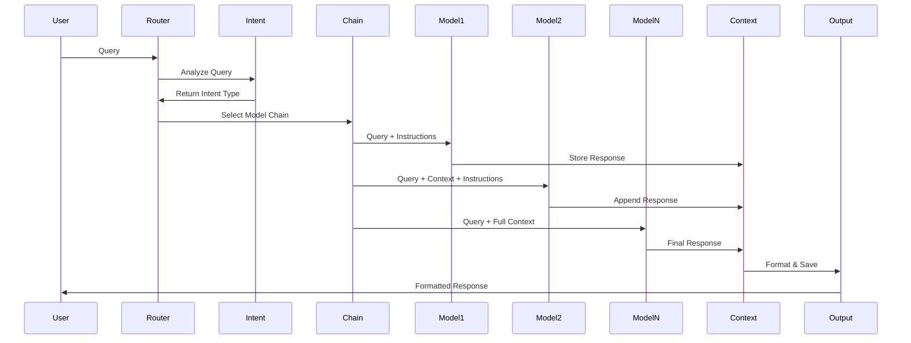
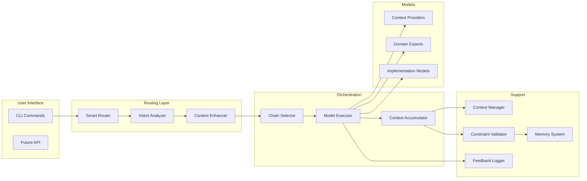
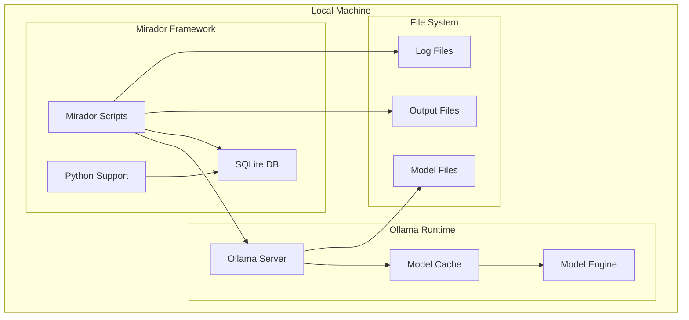

# Mirador AI Framework - System Architecture

## Table of Contents
- [Overview](#overview)
- [System Components](#system-components)
- [Data Flow Architecture](#data-flow-architecture)
- [Component Descriptions](#component-descriptions)
- [Design Patterns](#design-patterns)
- [Technical Decisions](#technical-decisions)
- [Performance Considerations](#performance-considerations)
- [Security Architecture](#security-architecture)

## Overview

Mirador is a sophisticated AI orchestration framework that implements chain-of-thought reasoning through intelligent model sequencing. Built on Ollama for local LLM execution, it provides personalized, context-aware AI assistance while maintaining complete privacy.

### Core Architecture Principles

1. **Local-First Execution**: All AI processing happens on-device via Ollama
2. **Chain-of-Thought Reasoning**: Complex queries are processed through sequences of specialized models
3. **Context Accumulation**: Each model in a chain receives enriched context from previous models
4. **Constraint Awareness**: Real-world limitations guide all recommendations
5. **Progressive Enhancement**: Information is revealed in stages from quick answers to deep analysis

## System Components

### 1. Entry Points Layer

The system provides multiple entry points optimized for different use cases:

```
├── bin/
│   ├── mirador-smart-v3          # Smart router with intent detection
│   ├── mirador-smart-v2          # Previous version router
│   └── mirador-ez                # Simplified interface
├── mirador_universal_runner_v2.sh # Universal chain runner
└── mirador_universal_runner_v3_optimized.sh # Optimized with diverse models
```

### 2. Routing Intelligence

The routing layer analyzes queries and selects appropriate model chains:

```python
Intent Detection Pipeline:
1. Query Normalization (lowercase, tokenization)
2. Pattern Matching (regex-based intent classification)
3. Priority Resolution (technical > quick > domain-specific > strategic)
4. Chain Selection (intent → model sequence mapping)
5. Context Enhancement (temporal, personal, constraints)
```

### 3. Model Orchestration Layer

80+ specialized models organized by function:

```
Model Categories:
├── Context Providers (Personal/Professional background)
├── Domain Experts (Financial, Health, Music, Louisville, Career)
├── Strategy Models (Planning, Analysis, Synthesis)
├── Implementation Models (Practical steps, Code generation)
└── Optimization Models (Speed, Quality, Creativity)
```

### 4. Support Systems

```
├── context_manager.py      # Context caching and management
├── constraint_validator.py # Real-world constraint checking
├── ai_memory/             # SQLite-based conversation history
└── logs/                  # Routing feedback and performance logs
```

## Data Flow Architecture



## Component Descriptions

### Smart Router (v3)

**Purpose**: Intelligently route queries to appropriate model chains based on intent detection.

**Key Features**:
- Regex-based pattern matching with prioritization
- Technical intent as highest priority
- Temporal context awareness
- Direct response instructions per intent
- Routing feedback logging

**Implementation**:
```bash
# Core routing logic
analyze_query() {
    # Priority order: technical > quick > financial > health > ... > strategic
    if [[ "$query" =~ (code|python|script|debug|api|function|optimize) ]]; then
        echo "technical"
    elif [[ "$query" =~ (quick|brief|summary|tldr) ]]; then
        echo "quick"
    # ... additional patterns
}
```

### Context Manager

**Purpose**: Manage context accumulation and caching across model chains.

**Key Features**:
- LRU cache for context storage
- Session-based context isolation
- Token count tracking
- Context compression when needed

**Data Structure**:
```python
{
    "session_id": "uuid",
    "timestamp": "ISO-8601",
    "query": "original query",
    "intent": "detected intent",
    "context_chain": [
        {
            "model": "model_name",
            "response": "model output",
            "tokens": 1234,
            "duration": 2.5
        }
    ],
    "total_tokens": 5678,
    "total_duration": 10.2
}
```

### Constraint Validator

**Purpose**: Ensure all recommendations respect real-world constraints.

**Constraints Checked**:
- Time Budget: 9 hours personal time daily
- Energy Levels: 10-point scale with time-based variations
- Financial Limits: $1,650 monthly after-tax income
- Family Commitments: Teen parenting responsibilities
- Work Schedule: Corporate hours + flexibility

### Memory System

**Purpose**: Persistent storage of conversations and learning patterns.

**Schema**:
```sql
-- Conversations table
CREATE TABLE conversations (
    id INTEGER PRIMARY KEY,
    session_id TEXT,
    timestamp DATETIME,
    query TEXT,
    intent TEXT,
    response TEXT,
    feedback_score INTEGER,
    models_used TEXT
);

-- Learning patterns table
CREATE TABLE patterns (
    id INTEGER PRIMARY KEY,
    pattern_type TEXT,
    pattern_value TEXT,
    frequency INTEGER,
    last_seen DATETIME
);
```

## Design Patterns

### 1. Chain of Responsibility Pattern

Each model in a chain processes the query and passes enriched context to the next model:

```
Query → Model1 → Context1 → Model2 → Context1+2 → Model3 → Final Output
```

### 2. Strategy Pattern

Different intents use different model chain strategies:

```python
strategies = {
    "technical": [matthew_context, master_coder, code_analyst, implementer],
    "financial": [matthew_context, financial_advisor, implementer],
    "creative": [creative_catalyst, strategy_architect, implementer]
}
```

### 3. Observer Pattern

Feedback system observes routing decisions and model outputs:

```bash
echo "$(date),$INTENT,\"$QUERY\"" >> routing_feedback.log
```

### 4. Factory Pattern

Model creation follows a consistent pattern:

```bash
ollama create model_name -f modelfile_definition
```

## Technical Decisions

### 1. Why Bash for Orchestration?

- **Simplicity**: Direct shell integration with Ollama CLI
- **Portability**: Works on any Unix-like system
- **Transparency**: Easy to understand and modify
- **Performance**: Minimal overhead for process spawning

### 2. Why Local Execution Only?

- **Privacy**: Complete data control
- **Reliability**: No internet dependency
- **Cost**: No API fees
- **Customization**: Full control over models and prompts

### 3. Why Sequential vs Parallel Processing?

- **Context Flow**: Each model needs previous model's insights
- **Quality**: Sequential processing ensures coherent responses
- **Debugging**: Easier to trace issues in linear flow

### 4. Why 80+ Specialized Models?

- **Expertise**: Each model optimized for specific domains
- **Flexibility**: Fine-grained control over responses
- **Evolution**: Models can be updated independently

## Performance Considerations

### Model Loading Strategy

```bash
# Models are loaded on-demand by Ollama
# First call incurs loading penalty (~2-5s)
# Subsequent calls use cached model (~0.5-1s)
```

### Response Time Optimization

1. **Quick Intent**: Single model, <3s response
2. **Standard Chain**: 3-4 models, 10-20s total
3. **Complex Chain**: 5-6 models, 30-45s total

### Memory Management

- **Context Window**: 8192 tokens per model
- **Response Length**: 2048 tokens typical
- **Session Cleanup**: Automatic after completion

### Caching Strategy

```python
# Context manager implements LRU cache
cache_key = f"{session_id}:{model_name}:{query_hash}"
cache_ttl = 900  # 15 minutes
```

## Security Architecture

### 1. Input Validation

```bash
# Query sanitization
query_clean=$(echo "$query" | sed 's/[;<>|`]//g')
```

### 2. Local Execution Sandbox

- All models run in Ollama's sandboxed environment
- No network access during inference
- File system access limited to Ollama's data directory

### 3. Sensitive Data Handling

```python
# Personal context is embedded in model files, not logs
# No PII in routing feedback logs
# Session data encrypted at rest (SQLite encryption)
```

### 4. Access Control

- Local user permissions only
- No remote access capabilities
- No authentication required (local-only)

## System Limits and Scaling

### Current Limits

- **Models**: ~100 models practical limit
- **Context**: 8192 tokens per model
- **Sessions**: Unlimited (filesystem bound)
- **Concurrent Requests**: 1 (sequential processing)

### Scaling Considerations

1. **Horizontal**: Multiple Mirador instances can run independently
2. **Vertical**: Larger models require more RAM (16GB minimum for 27B models)
3. **Storage**: ~200GB for full model set

## Future Architecture Enhancements

### 1. Parallel Processing Pipeline

```
Query → Router → [Model1, Model2, Model3] → Synthesis → Output
                    ↓       ↓       ↓
                 Context  Context Context
```

### 2. Dynamic Chain Composition

```python
# ML-based chain selection
optimal_chain = chain_selector.predict(query_embedding)
```

### 3. Distributed Model Serving

```
Mirador Client → Load Balancer → [Ollama Server 1, 2, 3...]
```

### 4. Real-time Learning

```sql
-- Feedback influences future routing
UPDATE routing_patterns 
SET weight = weight * 0.9 + feedback_score * 0.1
WHERE pattern = ?
```

## Architecture Diagrams

### Component Interaction Diagram



### Deployment Architecture



## Conclusion

The Mirador architecture represents a thoughtful balance between sophistication and simplicity. By leveraging local LLM execution through Ollama and implementing intelligent orchestration patterns, it provides powerful AI assistance while maintaining complete user control and privacy. The modular design allows for continuous improvement while the constraint-aware processing ensures practical, actionable outputs.