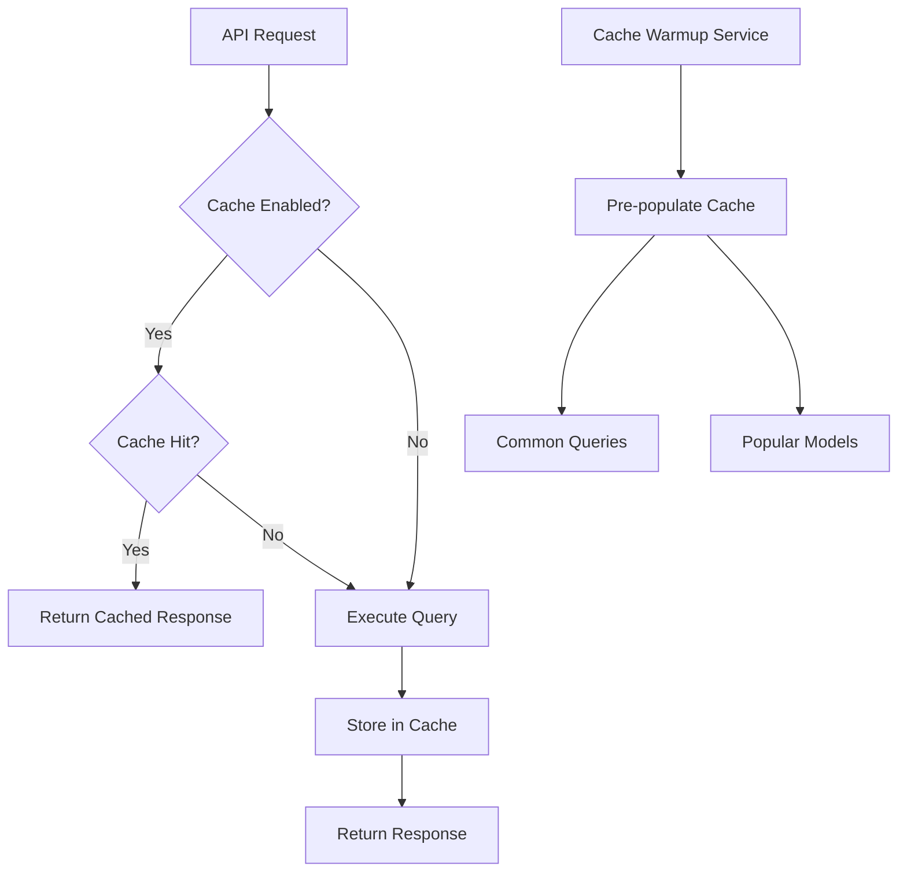

# Mirador API Caching System

## Overview

The Mirador API includes a comprehensive Redis-based caching system to improve performance and reduce load on AI models. The caching system is designed to be transparent, efficient, and easy to manage.

## Features

- **Multi-level Caching**: Different cache namespaces for queries, chains, models, and sessions
- **Intelligent Key Generation**: Automatic cache key generation based on request parameters
- **TTL Management**: Configurable time-to-live for different cache types
- **Cache Warmup**: Pre-populate cache with common queries
- **Cache Invalidation**: Automatic and manual cache invalidation strategies
- **Performance Monitoring**: Real-time cache statistics and hit rates
- **Graceful Degradation**: API continues to work if Redis is unavailable

## Architecture



## Cache Namespaces

### 1. Query Cache (`query`)
- Stores complete query responses
- TTL: 1 hour (default)
- Key format: `query:{hash(query+options)}`

### 2. Chain Cache (`chain`)
- Stores chain execution results
- TTL: 30 minutes (default)
- Key format: `chain:{hash(chain_type:format:prompt)}`

### 3. Model Cache (`model`)
- Stores individual model outputs
- TTL: 15 minutes (default)
- Key format: `model:{hash(model+prompt+options)}`

### 4. Session Cache (`session`)
- Stores session-related data
- TTL: 24 hours (default)
- Key format: `session:{session_id}:{data_type}`

## Configuration

### Environment Variables

```bash
# Redis connection
REDIS_URL=redis://localhost:6379/0
REDIS_MAX_CONNECTIONS=50

# Cache settings
CACHE_ENABLED=true
CACHE_KEY_PREFIX=mirador
CACHE_DEFAULT_TTL=3600

# TTL settings (seconds)
CACHE_TTL_QUERY=3600      # 1 hour
CACHE_TTL_CHAIN=1800      # 30 minutes
CACHE_TTL_MODEL=900       # 15 minutes
CACHE_TTL_SESSION=86400   # 24 hours

# Cache warmup
CACHE_WARMUP_ENABLED=true
CACHE_WARMUP_INTERVAL=3600  # 1 hour
```

### Cache Configuration in Code

```python
from src.api.cache import cache_manager, CacheTTL

# Configure cache manager
cache_manager = CacheManager(
    redis_url="redis://localhost:6379/0",
    key_prefix="mirador",
    enabled=True,
    default_ttl=3600
)

# Custom TTL values
CacheTTL.QUERY_RESPONSE = 7200  # 2 hours
CacheTTL.CHAIN_RESULT = 3600    # 1 hour
```

## Using Cache Decorators

### Basic Cache Decorator

```python
from src.api.cache import cached_response

@app.route('/api/endpoint')
@cached_response(namespace='custom', ttl=1800)
def my_endpoint():
    # Expensive operation
    return expensive_computation()
```

### Query-Specific Caching

```python
from src.api.cache import cached_query

@app.route('/api/query')
@cached_query(ttl=3600)
def execute_query():
    # Query will be cached automatically
    return process_query(request.json)
```

### Conditional Caching

```python
from src.api.cache import conditional_cache

@app.route('/api/data')
@conditional_cache(
    condition_func=lambda: request.args.get('cache') != 'false',
    ttl=1800
)
def get_data():
    return fetch_data()
```

### Cache Invalidation

```python
from src.api.cache import invalidate_cache

@app.route('/api/update', methods=['POST'])
@invalidate_cache(namespace='query', key_func=lambda: f"user:{g.user_id}")
def update_data():
    # Cache will be invalidated after successful update
    return update_resource()
```

## API Endpoints

### Get Cache Statistics

```bash
GET /api/v5/cache/stats

Response:
{
  "cache": {
    "enabled": true,
    "connected": true,
    "memory_used": "125.4MB",
    "total_keys": 1523,
    "hit_rate": 78.5,
    "namespaces": {
      "query": {
        "hits": 1250,
        "misses": 250,
        "hit_rate": 83.3
      },
      "chain": {
        "hits": 450,
        "misses": 150,
        "hit_rate": 75.0
      }
    }
  },
  "warmup": {
    "enabled": true,
    "queries_configured": 5,
    "last_run": "2024-01-10T10:30:00Z"
  }
}
```

### Clear Cache

```bash
# Clear all cache (admin only)
POST /api/v5/cache/clear

# Clear specific namespace
POST /api/v5/cache/clear
{
  "namespace": "query"
}

# Clear by pattern
POST /api/v5/cache/clear
{
  "pattern": "query:user:123:*"
}

# Clear user cache
DELETE /api/v5/cache/user/{user_id}

# Clear session cache
DELETE /api/v5/cache/session/{session_id}
```

### Trigger Cache Warmup

```bash
POST /api/v5/cache/warmup

Response:
{
  "success": true,
  "results": {
    "queries_warmed": 5,
    "models_warmed": 3,
    "errors": 0,
    "duration": 12.5
  }
}
```

### List Cache Keys (Admin)

```bash
GET /api/v5/cache/keys?namespace=query&pattern=*user*&limit=50

Response:
{
  "keys": [
    "query:user:123:abc123",
    "query:user:456:def456"
  ],
  "count": 2,
  "pattern": "*user*",
  "limited": false
}
```

## Cache Headers

The API includes cache-related headers in responses:

- `X-Cache`: `HIT` or `MISS` - Indicates if response was served from cache
- `X-Cache-TTL`: Time-to-live in seconds for cached responses
- `Cache-Control`: Standard HTTP cache control directives

## Client-Side Usage

### Controlling Cache Behavior

```python
# Python SDK
from mirador import MiradorClient

client = MiradorClient(api_key="your-key")

# Disable cache for a specific query
response = client.query(
    "What's the latest news?",
    use_cache=False
)

# Force cache refresh
response = client.query(
    "Analysis needed",
    options={"cache": "refresh"}
)
```

### JavaScript/TypeScript

```javascript
// Disable cache for a request
const response = await fetch('/api/v5/query', {
  method: 'POST',
  headers: {
    'Content-Type': 'application/json',
    'Cache-Control': 'no-cache'
  },
  body: JSON.stringify({
    query: "Real-time data needed",
    use_cache: false
  })
});
```

## Cache Warmup Configuration

### Default Warmup Queries

```python
CACHE_WARMUP_QUERIES = [
    {
        "query": "What are the most important things to focus on today?",
        "chain_type": "life_optimization",
        "format": "quick"
    },
    {
        "query": "Give me a productivity tip",
        "chain_type": "rapid_decision",
        "format": "quick"
    }
]
```

### Custom Warmup Configuration

```python
# Configure via API
PUT /api/v5/cache/warmup/config
{
  "enabled": true,
  "interval": 3600,
  "queries": [
    {
      "query": "Custom warmup query",
      "chain_type": "business_acceleration",
      "format": "summary"
    }
  ]
}
```

## Performance Optimization

### 1. Cache Key Strategy
- Use consistent parameter ordering
- Include only relevant parameters in cache keys
- Hash long values to keep keys short

### 2. TTL Tuning
- Shorter TTL for frequently changing data
- Longer TTL for stable responses
- Consider user patterns when setting TTLs

### 3. Memory Management
- Monitor Redis memory usage
- Implement eviction policies (LRU recommended)
- Set maximum memory limits

### 4. Batch Operations

```python
# Use pipeline for multiple cache operations
with cache_manager.pipeline() as pipe:
    pipe.set('key1', 'value1', ttl=3600)
    pipe.set('key2', 'value2', ttl=3600)
    pipe.set('key3', 'value3', ttl=3600)
    results = pipe.execute()
```

## Monitoring and Debugging

### Cache Metrics

Monitor these key metrics:
- **Hit Rate**: Percentage of requests served from cache
- **Memory Usage**: Redis memory consumption
- **Key Count**: Number of cached items
- **Eviction Rate**: Frequency of cache evictions

### Debug Mode

Enable cache debugging:

```python
import logging
logging.getLogger('mirador.cache').setLevel(logging.DEBUG)
```

### Common Issues

1. **Low Hit Rate**
   - Check if queries are too specific
   - Verify TTL settings are appropriate
   - Ensure cache keys are generated consistently

2. **High Memory Usage**
   - Reduce TTL values
   - Implement cache size limits
   - Clean up expired keys regularly

3. **Cache Misses After Deployment**
   - Run cache warmup after deployment
   - Consider blue-green deployments
   - Implement cache versioning

## Best Practices

1. **Cache Appropriate Data**
   - Cache expensive computations
   - Don't cache user-specific sensitive data
   - Avoid caching real-time data

2. **Invalidation Strategy**
   - Invalidate on data changes
   - Use pattern-based invalidation
   - Implement cache versioning for deployments

3. **Error Handling**
   - Always have fallback for cache failures
   - Log cache errors but don't fail requests
   - Monitor Redis connection health

4. **Security**
   - Don't cache authentication tokens
   - Sanitize cache keys to prevent injection
   - Use separate cache namespaces for different data types

## Examples

### Custom Cache Implementation

```python
from src.api.cache import cache_manager

# Store custom data
cache_manager.set(
    namespace='custom',
    identifier='my-data',
    value={'result': 'processed'},
    ttl=1800
)

# Retrieve custom data
data = cache_manager.get(
    namespace='custom',
    identifier='my-data'
)

# Delete specific cache entry
cache_manager.delete(
    namespace='custom',
    identifier='my-data'
)
```

### Cache Warmup Service

```python
from src.api.cache import cache_warmup_service

# Add custom warmup query
cache_warmup_service.warmup_queries.append({
    "query": "Industry analysis for healthcare",
    "chain_type": "deep_analysis",
    "format": "detailed"
})

# Manually trigger warmup
await cache_warmup_service.warmup_batch()

# Warm specific session
await cache_warmup_service.warmup_session(
    session_id='abc123',
    user_id='user456'
)
```

## Conclusion

The Mirador caching system provides a robust foundation for improving API performance while maintaining flexibility and control. By following these guidelines and best practices, you can ensure optimal cache utilization and provide a fast, responsive experience for your users.